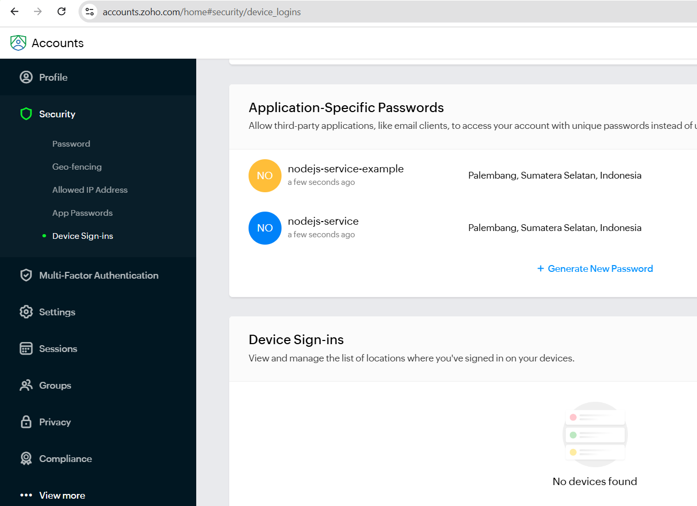

# Node.js Email Service with Zoho Mail

This project demonstrates how to set up an email service in Node.js using **Zoho Mail** as the SMTP provider with **Nodemailer**. This service is ideal for sending emails such as welcome messages, notifications, and other transactional emails.

## Overview



*The above diagram illustrates how the email service flow works, from setting up the SMTP connection with Zoho Mail to sending the email.*

## Prerequisites

- **Node.js** (version 16 or higher recommended)
- **NPM** package manager
- **Zoho Mail** account

## Setup

### 1. Clone the Repository

```bash
git clone https://github.com/yourusername/nodejs-email-service.git
cd nodejs-email-service
